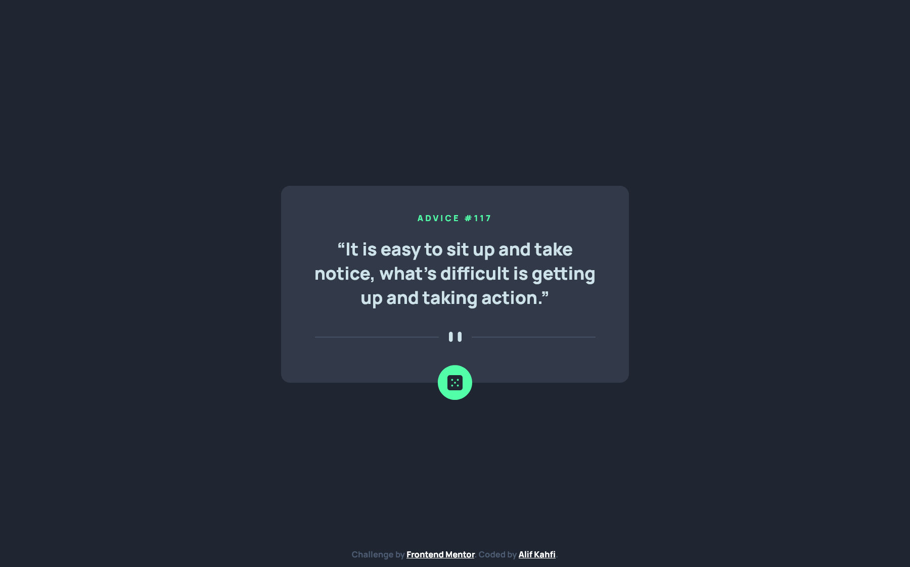
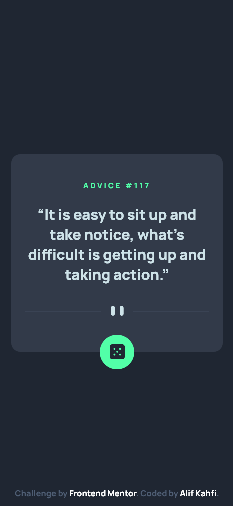

# Frontend Mentor - Advice generator app solution

This is a solution to the [Advice generator app challenge on Frontend Mentor](https://www.frontendmentor.io/challenges/advice-generator-app-QdUG-13db). Frontend Mentor challenges help you improve your coding skills by building realistic projects.

## Table of contents

- [Overview](#overview)
  - [The challenge](#the-challenge)
  - [Screenshot](#screenshot)
  - [Links](#links)
- [My process](#my-process)
  - [Built with](#built-with)
  - [What I learned](#what-i-learned)
- [Author](#author)

## Overview

### The challenge

Users should be able to:

- View the optimal layout for the app depending on their device's screen size
- See hover states for all interactive elements on the page
- Generate a new piece of advice by clicking the dice icon

### Screenshot

- Desktop: 

- Mobile: 

### Links

- Solution URL: [Frontend Mentor solution](https://www.frontendmentor.io/solutions/advice-generator-app-2F6bhZ9Z4v)
- Live Site URL: [Live site using Vercel](https://advice-generator-app-main-l7aar8zb4-alifkm.vercel.app/)

## My process

### Built with

- Semantic HTML5 markup
- Flexbox method
- SASS
- Mobile-first workflow
- [React](https://reactjs.org/) - JS library

### What I learned

In this challenge I learned how to use react js and fetching some API to my website.

## Author

- Instagram - [alifkm](https://www.instagram.com/alifkm/)
- Frontend Mentor - [Alifkm](https://www.frontendmentor.io/profile/Alifkm)
- Twitter - [alifkahfi10](https://twitter.com/AlifKahfi10?t=nxZrhm9DfsdiNFUcbeGSZA&s=06)